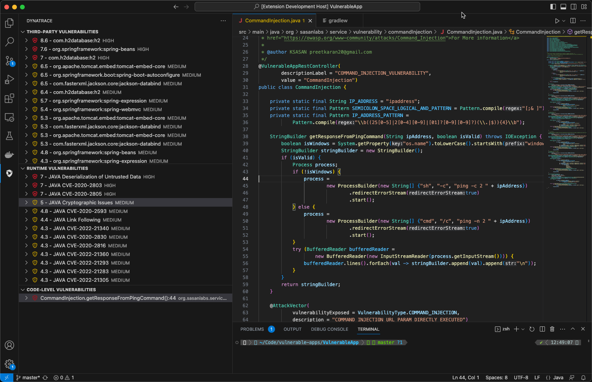

# Dynatrace Visual Studio Code extension

This extension integrates information from Dynatrace Application Security with Visual Studio Code to provide information about vulnerabilities to the developers. Since Dynatrace App Sec detects vulnerabilities at runtime, this requires the application to be deployed to an dev environment monitored by Dynatrace. 

> Note: This extension is not officially supported by Dynatrace

## Features

The extension provides information about the following vulnerabilities
- Third-party vulnerabilities for Java, .NET, Go, Node.js, PHP
- Vulnerabilities in the runtime for Java, .NET, Node.js
- Code-Level vulnerabilities for Java


Describe specific features of your extension including screenshots of your extension in action. Image paths are relative to this README file.

For example if there is an image subfolder under your extension project workspace:




## Requirements

The extension needs to be connected to a Dynatrace environment and requires a token with the `securityProblems.read` scope

## Extension Settings

Include if your extension adds any VS Code settings through the `contributes.configuration` extension point.

For example:

This extension contributes the following settings:

* `dynatrace.tenantUrl`: The url of your Dynatrace tenant *(https://xxxxx.sprint.dynatracelabs.com)*. You will also need an API token, you will automatically be prompted to enter it after setting the tenant URL
* `dynatrace.filterType`: Specify a filter for the security problems, see the documentation for possible values: https://www.dynatrace.com/support/help/shortlink/api-v2-security-problems-get-all
* `dynatrace.filter`: Specify a filter for the security problems, value depends on the selected filter type

## Building the extension
To build the extension, the vscode/vsce package needs to be installed:
```bash
npm install -g @vscode/vsce
```
See [vsce instructions](https://code.visualstudio.com/api/working-with-extensions/publishing-extension#vsce) for more details

Once the package is installed, the following command will create a VSIX file that can be installed in vs code:
```bash
vsce package
```
The generated VSIX file can then be install using the *Install from VSIX* command in the *Extensions* view command dropdown. See [instructions](https://code.visualstudio.com/docs/editor/extension-marketplace#_install-from-a-vsix) for more details
